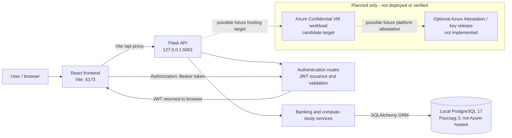

# SecureBank Architecture and Status

## Current Implementation

SecureBank is a local development prototype. The React/Vite frontend runs on port 5173 and proxies `/api` requests to Flask on port 5001. Flask authenticates users with JWT bearer tokens and accesses PostgreSQL through SQLAlchemy and Psycopg 3. The database is the local PostgreSQL service configured by `DATABASE_URL`; it is not hosted in Azure.

The dashed Azure links are design intent only. They do not represent a working Azure connection, an Azure resource, or successful hardware attestation. There is no Key Vault integration in the application.

## Implemented Flow

1. A user signs in through the React login page. Flask validates the password hash and issues a signed JWT.
2. The frontend stores the token in browser local storage and sends it in the `Authorization` header for protected requests.
3. Flask routes derive the user identity from the JWT, scope account and transaction queries to that user, and call banking services.
4. SQLAlchemy persists account balances and simulated ledger entries in PostgreSQL. Amounts use Python `Decimal` and SQL `numeric(14,2)`.
5. `/api/health` reports the active database engine and service status. `/api/security` reports a qualitative compute comparison and a local/configuration-based assessment only.

## Security Boundaries and Limitations

- The app uses local HTTP in development; TLS termination is not implemented.
- The prototype has no Azure deployment, MAA quote validation, attestation-gated secret release, Key Vault, or confidential disk configuration.
- Environment variables and guest device files are indicators, not proof of Azure placement or attestation. The app intentionally never reports a verified confidential VM.
- A confidential VM can reduce host access to protected guest memory and processor state. It does not remove the need to secure the guest OS, application, database, identity, network, policies, and operational controls.
- This project is not PCI DSS certified, SOC 2 audited, or GDPR compliant.
- Demo transactions and account balances are fictional. No payment rails are connected.

## Database and Data Safety

The application uses the configured PostgreSQL `DATABASE_URL` with Psycopg 3. Test fixtures explicitly use an in-memory SQLite database; the application no longer silently switches to SQLite. `db.create_all()` validates/creates missing tables at startup but is not a schema migration system. Seeding adds missing demo records and does not reset the database.
