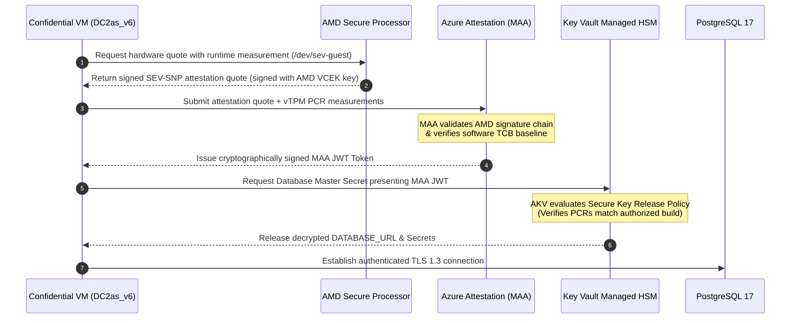

# Azure Confidential Compute Architecture Study: SecureBank

> **Academic & Industry Research Study**  
> **Target Cloud Environment:** Microsoft Azure (`southindia` region)  
> **Evaluated Compute SKUs:** `Standard_DC2as_v6` & `Standard_EC2as_v6` (AMD SEV-SNP)  
> **Status:** Architecture Design & Feasibility Study (Deployment not executed due to subscription quota = 0)

---

## 1. Executive Summary & Purpose

Modern financial platforms face a critical architectural challenge in multi-tenant public clouds: **Data-in-Use exposure**.

While industry standards provide robust defenses for data-at-rest (AES-256 disk encryption) and data-in-transit (TLS 1.3), traditional virtual machines process cardholder records, transaction ledgers, and cryptographic keys in **unencrypted plaintext in physical memory (RAM)**. Under standard hypervisor models, host administrators, rogue cloud operators, or hypervisor breakout vulnerabilities can extract memory dumps containing customer balances, session tokens, and database master secrets.

This study presents the architectural design of **SecureBank**, an institutional banking application engineered to leverage **Microsoft Azure Confidential Virtual Machines** backed by **AMD SEV-SNP (Secure Encrypted Virtualization-Secure Nested Paging)** and virtual Trusted Platform Module (**vTPM 2.0**) hardware attestation.

```
┌────────────────────────────────────────────────────────────────────────────────────────┐
│                              DISCLOSURE & CURRENT STATUS                               │
│                                                                                        │
│ This document details a target production cloud architecture. Azure Cloud Shell checks │
│ in South India confirmed that AMD SEV-SNP SKUs (Standard_DC2as_v6, Standard_EC2as_v6)   │
│ exist without SKU restrictions; however, current subscription quota for DCasv6/ECasv6  │
│ families is 0. Consequently, no cloud resources were provisioned, and no live Azure     │
│ guest attestation was executed. The full application logic, access control boundaries, │
│ and database transactions are verified and demonstrated via the local prototype.        │
└────────────────────────────────────────────────────────────────────────────────────────┘
```

---

## 2. Multi-Tier Application Architecture

SecureBank is architected across three decoupled tiers following defense-in-depth principles:

```mermaid
graph TD
    subgraph Client_Domain["Client Domain"]
        User["👤 Bank Customer / Auditor"]
        Browser["🌐 React 19 Client UI (Vite)"]
        User --> Browser
    end

    subgraph Azure_Perimeter["Perimeter Security Subnet (10.1.0.0/24)"]
        WAF["🛡️ Azure Application Gateway + WAF v2<br/>(TLS 1.3 Termination, Rate Limiting, DDoS)"]
        Bastion["🔒 Azure Bastion Host<br/>(Private SSH over TLS 443, No Public IP)"]
    end

    subgraph App_Subnet["Application Subnet (10.1.1.0/24) - Confidential Enclave"]
        subgraph CVM["🖥️ Azure Confidential VM (Standard_DC2as_v6)"]
            SNP["🔒 AMD SEV-SNP Silicon Memory Controller<br/>AES-128/256 Hardware Encryption"]
            Backend["⚙️ Flask REST API + Gunicorn WSGI<br/>(Port 5001, Arbitrary Decimal Precision)"]
            vTPM["🔐 vTPM 2.0 Engine<br/>Platform Configuration Registers (PCRs)"]
            SNP --- Backend
            vTPM --- Backend
        end
    end

    subgraph DB_Subnet["Data Subnet (10.1.2.0/24) - Private Link"]
        PG["🗄️ Azure Database for PostgreSQL 17 Flexible<br/>(Private Endpoint 10.1.2.4, CMK Encrypted at Rest)"]
    end

    subgraph Cloud_Attestation["Azure Attestation & Secrets Control"]
        MAA["📜 Microsoft Azure Attestation (MAA)<br/>(Validates AMD Silicon Measurement Quote)"]
        AKV["🔑 Azure Key Vault Managed HSM<br/>(Secure Key Release with Attestation Policy)"]
    end

    Browser -->|HTTPS / TLS 1.3| WAF
    WAF -->|Internal TLS 1.3 (Port 5001)| Backend
    Bastion -.->|Encrypted SSH (Port 22)| CVM
    Backend -->|Private Link / SSL (Port 5432)| PG
    vTPM -->|Hardware Attestation Quote| MAA
    MAA -->|Signed Token with Claims| AKV
    AKV -.->|Release Database Decryption Keys| Backend
```

*A high-resolution standalone SVG diagram is available at [`docs/securebank-azure-architecture.svg`](securebank-azure-architecture.svg).*

---

## 3. Component Deep Dive

### 3.1 Presentation Tier (Frontend)
- **Technology Stack:** React 19, Vite, Lucide Icons, Vanilla CSS Design Tokens.
- **Hosting Strategy:** Azure Static Web Apps or Blob Storage Static Website behind Azure Application Gateway.
- **Core Responsibilities:**
  - Institutional banking interface with strict academic white theme (high-contrast `#ffffff` surfaces, `#0f172a` typography, 1px `#e2e8f0` borders).
  - Client-side validation: preventing non-positive transfers, decimal rounding errors, and self-account transfers.
  - Truthful compute environment badge rendering (`LOCAL_UNVERIFIED` vs `VERIFIED_CONFIDENTIAL_VM`).
  - Interactive research dashboard comparing Standard, Trusted Launch, Isolated, and Confidential VM paradigms.

### 3.2 Application Tier (Backend Services)
- **Technology Stack:** Python 3.10+, Flask, Flask-SQLAlchemy, Flask-JWT-Extended, Gunicorn WSGI.
- **Target Compute SKU:** `Standard_DC2as_v6` (2 vCPUs, 8 GB RAM, AMD EPYC™ processor with SEV-SNP).
- **Security Boundaries:**
  - **Non-Root Execution:** Runs under dedicated unprivileged system account (`azureuser` / `www-data`).
  - **Zero Floating-Point Drift:** Uses Python's arbitrary-precision `decimal.Decimal` and SQL `numeric(14,2)` for all monetary ledger calculations.
  - **Tenant Isolation:** Enforces strict `user_id` ownership filtering on every account query and transaction operation.
  - **Stateless Tokens:** Ephemeral HMAC-SHA256 JWT tokens with automatic expiry and zero persistent server session state.

### 3.3 Data Tier (PostgreSQL 17 Database)
- **Technology Stack:** Azure Database for PostgreSQL 17 Flexible Server (and local PostgreSQL 17 via Psycopg 3).
- **Storage Protection:** Transparent Data Encryption (TDE) with Customer-Managed Keys (CMK) stored in Azure Key Vault Managed HSM.
- **Relational Integrity:**
  - Strict Foreign Key constraints linking `transactions` to `bank_accounts` and `users`.
  - Immutable audit trail (`TXN-YYYYMMDD-...` reference numbers, ISO 8601 timestamps, signed balance transitions).

---

## 4. Hardware-Backed Confidential Computing via AMD SEV-SNP

### 4.1 What is AMD SEV-SNP?
AMD Secure Encrypted Virtualization-Secure Nested Paging (SEV-SNP) provides hardware-enforced isolation between the guest virtual machine and the underlying hypervisor:

1. **Hardware Memory Encryption:**
   - The on-die **AMD Secure Processor (ASP)** generates an ephemeral AES-128/256 memory encryption key at VM creation.
   - Keys are burned into the CPU memory controller; they never leave the silicon die and are inaccessible to Microsoft engineers, the host OS, or other virtual machines.
   - All memory bus transactions between the CPU cache and physical DDR5 DIMMs are hardware-encrypted.
2. **Secure Nested Paging (SNP):**
   - Introduces the **Reverse Map Table (RMP)** in hardware.
   - Prevents hypervisor-level memory modification attacks, memory replay attacks, and page-remapping spoofing.
3. **Zero-Trust Hypervisor Model:**
   - In standard virtualization, the hypervisor resides inside the **Trusted Computing Base (TCB)**.
   - Under AMD SEV-SNP, the hypervisor is **formally excluded from the TCB**. Even with complete administrative root access on the physical server blade, memory dumps yield only ciphertext.

---

## 5. Security Boundaries & Network Segmentation

The proposed cloud network architecture establishes four strict trust boundaries:

| Tier / Subnet | CIDR Range | Allowed Inbound Traffic | Allowed Outbound Traffic | Network Controls |
| :--- | :--- | :--- | :--- | :--- |
| **Ingress Subnet** | `10.1.0.0/24` | HTTPS (443) from Internet | TCP 5001 to App Subnet | WAF v2, DDoS Protection Standard |
| **App Subnet (CVM)** | `10.1.1.0/24` | TCP 5001 from Ingress Subnet; TCP 22 from Bastion | TCP 5432 to DB Subnet; HTTPS 443 to MAA | NSG denying all direct Internet ingress; Private IP only |
| **Data Subnet** | `10.1.2.0/24` | TCP 5432 strictly from App Subnet | None (Deny all outbound) | Azure Private Link; Public access = Disabled |
| **Management** | `10.1.255.0/24` | HTTPS 443 to Bastion portal | SSH to App Subnet | Azure Bastion (no public IP on VM) |

---

## 6. Remote Attestation & Secure Key Release Workflow

In a production confidential deployment, secrets (such as the database connection string and TLS certificates) are never stored in plaintext configuration files. Instead, they are retrieved via **Hardware Remote Attestation**:



---

## 7. Comparative Analysis: Standard vs Trusted Launch vs Isolated vs Confidential

The study evaluated all four compute tiers against the specific security requirements of a sensitive banking ledger:

| Feature Dimension | Standard VM | Trusted Launch VM | Isolated VM | Confidential VM (DC2as_v6) |
| :--- | :--- | :--- | :--- | :--- |
| **Hardware Tenancy** | Shared physical host | Shared physical host | Dedicated physical blade | Cryptographically isolated VM enclave |
| **Boot Integrity** | Optional / Unenforced | ✅ **Secure Boot + vTPM** | Optional Gen2 | ✅ **Secure Boot + vTPM 2.0** |
| **Data-in-Use (RAM)** | ❌ Plaintext RAM | ❌ **Plaintext RAM** | ❌ Plaintext RAM | ✅ **Hardware AES-128/256 (AMD SEV-SNP)** |
| **Hypervisor in TCB** | Yes (Fully trusted) | Yes (Fully trusted) | Yes (Fully trusted) | 🛡️ **Zero Trust (Excluded from TCB)** |
| **Cloud Operator Risk**| Vulnerable to RAM dump | Vulnerable to RAM dump | Vulnerable to RAM dump | ✅ Protected (Keys sealed in CPU die) |
| **Attestation Scope** | None | Boot measurement log | Host cert only | ✅ **Silicon Root of Trust (AMD) + MAA** |
| **Monthly Sizing Cost**| Baseline ($) | Baseline ($0 surcharge) | Prohibitive ($3,800+/mo) | Modest (~15–22% premium over standard) |

> **Key Architectural Takeaway:**  
> Trusted Launch safeguards the boot sequence against rootkits, but leaves runtime memory in plaintext. Isolated VMs guarantee physical tenancy, but leave memory readable by the hypervisor at extreme cost. Only **Confidential VMs** deliver end-to-end data-in-use protection against hypervisor tampering and operator inspection at practical economics.

---

## 8. Limitations & Feasibility Realities

1. **Hardware-Enforced Boundary:** Confidential computing cannot be verified purely through software or local workstations. It requires genuine silicon support (AMD SEV-SNP on Zen 3/Zen 4 EPYC or Intel TDX).
2. **Quota & Subscription Governance:** As detailed in [`docs/azure-quota-limitation.md`](azure-quota-limitation.md), educational and trial subscriptions frequently enforce 0-vCPU quotas on specialized confidential SKUs, requiring explicit capacity exception requests.
3. **Cryptographic Overhead:** Memory controller encryption introduces a measured 1.5%–3.5% latency overhead for memory-intensive workloads, which is acceptable for banking transactions.
